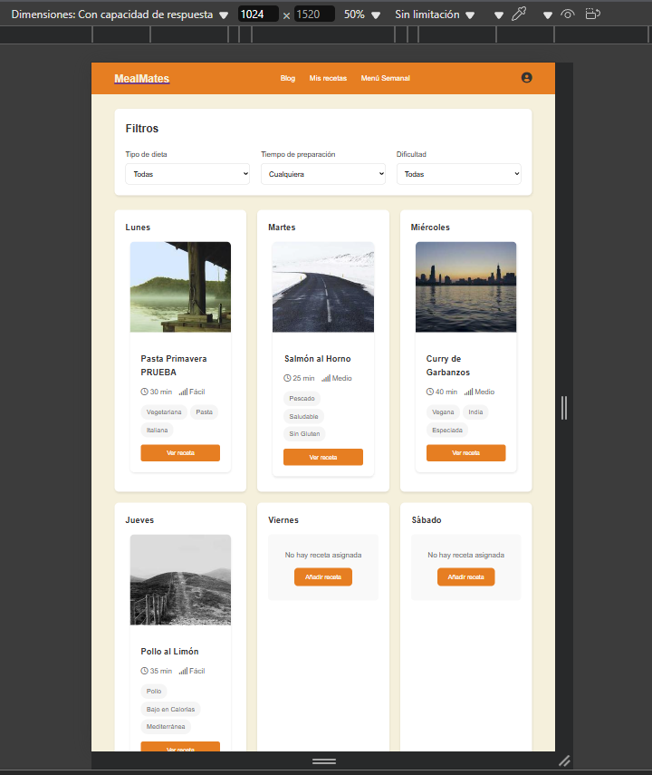
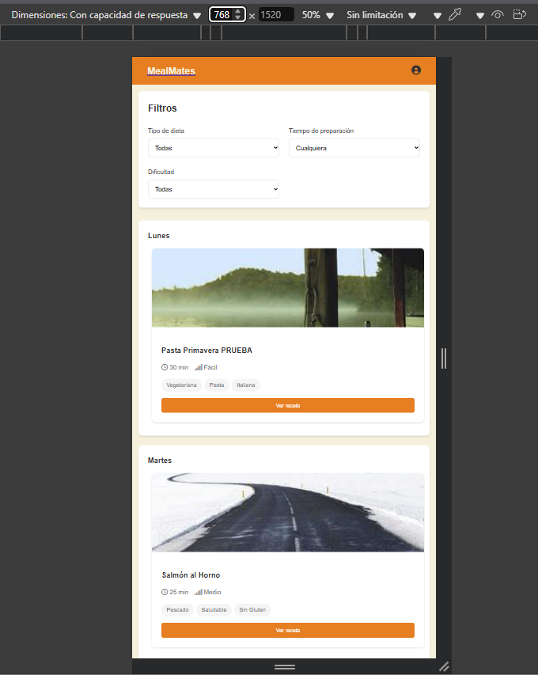
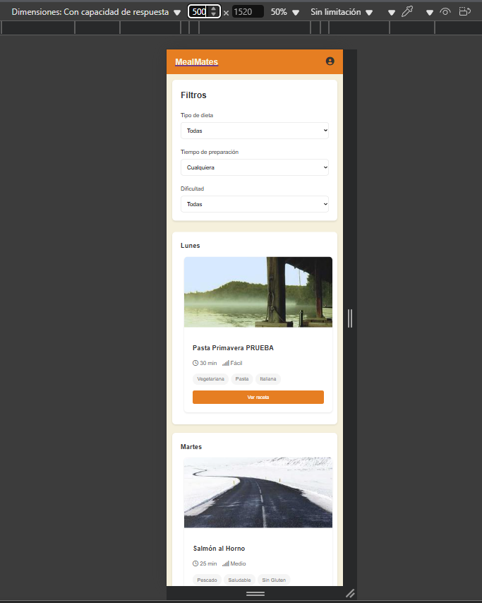

# 🍳 MealMates

## Índice de Contenidos

- [🍳 MealMates](#-mealmates)
  - [Índice de Contenidos](#índice-de-contenidos)
  - [📋 Tabla de Contenidos](#-tabla-de-contenidos)
  - [🎯 Sobre el Proyecto](#-sobre-el-proyecto)
    - [🎓 Asignatura](#-asignatura)
  - [Sprint 1: Empezando](#sprint-1-empezando)
    - [🛠 Tecnologías](#-tecnologías)
    - [✨ Características](#-características)
    - [📁 Estructura](#-estructura)
    - [👥 Equipo](#-equipo)
    - [👨‍💻 Contribución](#-contribución)
    - [📊 Organización](#-organización)
      - [Metodología](#metodología)
      - [Herramientas de Gestión](#herramientas-de-gestión)
  - [Sprint 2: Carga Dinámica y Diseño Responsive](#sprint-2-carga-dinámica-y-diseño-responsive)
    - [1. Estructura de Datos (JSON Schema)](#1-estructura-de-datos-json-schema)
    - [2. Componetización con Web Components](#2-componetización-con-web-components)
    - [3. Carga Dinámica de Contenido](#3-carga-dinámica-de-contenido)
    - [4. Diseño Responsive](#4-diseño-responsive)
    - [Capturas de Pantalla](#capturas-de-pantalla)
  - [Documentación](#documentación)

<div align="center">

[](https://developer.mozilla.org/es/docs/Web/HTML)
[](https://developer.mozilla.org/es/docs/Web/CSS)
[](https://developer.mozilla.org/es/docs/Web/JavaScript)
[](https://developer.mozilla.org/es/docs/Learn/CSS/CSS_layout/Responsive_Design)
[](https://trello.com/b/your-board)

Tu compañero perfecto para la cocina 🥘

</div>

## 📋 Tabla de Contenidos

- [🍳 MealMates](#-mealmates)
  - [Índice de Contenidos](#índice-de-contenidos)
  - [📋 Tabla de Contenidos](#-tabla-de-contenidos)
  - [🎯 Sobre el Proyecto](#-sobre-el-proyecto)
    - [🎓 Asignatura](#-asignatura)
  - [Sprint 1: Empezando](#sprint-1-empezando)
    - [🛠 Tecnologías](#-tecnologías)
    - [✨ Características](#-características)
    - [📁 Estructura](#-estructura)
    - [👥 Equipo](#-equipo)
    - [👨‍💻 Contribución](#-contribución)
    - [📊 Organización](#-organización)
      - [Metodología](#metodología)
      - [Herramientas de Gestión](#herramientas-de-gestión)
  - [Sprint 2: Carga Dinámica y Diseño Responsive](#sprint-2-carga-dinámica-y-diseño-responsive)
    - [1. Estructura de Datos (JSON Schema)](#1-estructura-de-datos-json-schema)
    - [2. Componetización con Web Components](#2-componetización-con-web-components)
    - [3. Carga Dinámica de Contenido](#3-carga-dinámica-de-contenido)
    - [4. Diseño Responsive](#4-diseño-responsive)
    - [Capturas de Pantalla](#capturas-de-pantalla)
  - [Documentación](#documentación)

## 🎯 Sobre el Proyecto

MealMates es una aplicación web desarrollada como parte de la asignatura de **Programación Web y Móvil** en la Universidad de Las Palmas de Gran Canaria. El proyecto se centra en crear una plataforma intuitiva para la gestión y descubrimiento de recetas culinarias, poniendo en práctica principios modernos de desarrollo web y diseño responsive.

Nuestro enfoque combina una experiencia de usuario atractiva con funcionalidades prácticas para ayudar a los usuarios a organizar, descubrir y compartir sus recetas favoritas.

### 🎓 Asignatura
- **Nombre**: Programación Web y Móvil
- **Curso**: 2024/2025
- **Grado**: Ingeniería Informática
- **Universidad**: Universidad de Las Palmas de Gran Canaria

## Sprint 1: Empezando

Para ejecutar este proyecto localmente:

```bash
# Clonar el repositorio
git clone https://github.com/Pablistenico/PWM.git

# Navegar al directorio
cd PWM

# Abrir en navegador (o usar Live Server en VSCode)
open index.html
```

### 🛠 Tecnologías

- **Frontend**:
  - HTML5 (Estructura semántica, SEO básico)
  - CSS3 (Custom Properties, Flexbox, Grid, Animaciones)
  - JavaScript (ES6+, Manipulación del DOM, Fetch API)
  - FontAwesome (iconografía)
  - Diseño Mobile-First

- **Herramientas de Desarrollo**:
  - Git & GitHub (Control de versiones)
  - Visual Studio Code (Editor)
  - Live Server (Servidor local)
  - Chrome DevTools (Depuración)

### ✨ Características

- 📱 Diseño responsive para todos los dispositivos
- 🎨 Interfaz moderna e intuitiva con animaciones fluidas
- 🔍 Búsqueda y filtrado avanzado de recetas por ingredientes, tiempo y dificultad
- 📝 Creación y edición de recetas con sistema de categorización
- 📅 Planificador semanal de menús con recordatorios
- 👤 Gestión de perfiles de usuario personalizable
- 💾 Guardado de recetas favoritas con sincronización
- 🌙 Modo oscuro para mejor experiencia nocturna
- 📊 Estadísticas de recetas más populares

### 📁 Estructura

```bash
mealmates/
├── assets/
│ ├── css/
│ │ ├── styles.css
│ │ ├── recipe.css
│ │ └── ...
│ ├── js/
│ │ ├── script.js
│ │ └── ...
│ └── img/
├── data/
│ │ ├── recipes.json
│ │ ├── categories.json  
│ │ └── ...
├── docs/
│ ├── webcomponents-docs.md
│ ├── form-validation-docs.md
│ └── ...
├── src/
│ ├── recipe.html
│ ├── profile.html
│ ├── components/
│ │ ├── recipe-card.html
│ │ ├── recipe-form.html
│ │ └── ...
│ └── ...
└── index.html
```

### 👥 Equipo

<table>
  <tr>
    <td align="center">
      <a href="https://github.com/Pablistenico">
        
        <br />
        <sub><b>Pablo Monzón Toca</b></sub>
      </a>
      <!--div>Frontend & UI</div-->
    </td>
    <td align="center">
      <a href="https://github.com/gitfrandu4">
        
        <br />
        <sub><b>Francisco Javier López-Dufour Morales</b></sub>
      </a>
      <!--div>JavaScript & UX</div-->
    </td>
    <td align="center">
      <a href="https://github.com/ElenaArtiles">
        
        <br />
        <sub><b>Elena Artiles Morales</b></sub>
      </a>
      <!--div>Diseño & CSS</div-->
    </td>
  </tr>
</table>

### 👨‍💻 Contribución

Para contribuir al proyecto:

1. Haz fork del repositorio
2. Crea una rama para tu función (`git checkout -b feature/NuevaFuncion`)
3. Haz commit de tus cambios (`git commit -m 'Añadir: Nueva función'`)
4. Pushea a la rama (`git push origin feature/NuevaFuncion`)
5. Abre un Pull Request

### 📊 Organización

#### Metodología
- Desarrollo iterativo e incremental
- Reuniones semanales de seguimiento
- Control de versiones con Git
  
#### Herramientas de Gestión
- **Trello**: [Enlace al tablero](https://trello.com/b/A9OGJGil/pwm)
  - Seguimiento de tareas
  - Distribución de trabajo
  - Planificación de sprints

---

## Sprint 2: Carga Dinámica y Diseño Responsive

Durante el Sprint 2, hemos implementado las siguientes funcionalidades y mejoras técnicas:

### 1. Estructura de Datos (JSON Schema)

Hemos definido un esquema de datos robusto para la aplicación, que incluye las siguientes colecciones:

```json
{
  "database": "my_database",
  "collections": [
    {
      "name": "users",
      "fields": {
        "id": { "type": "string", "unique": true, "primary": true },
        "email": { "type": "string", "unique": true },
        "password": { "type": "string" },
        "name": { "type": "string" },
        "avatar": { "type": "string" },
        "favoriteRecipes": { "type": "array", "items": { "type": "string", "reference": "recipes.id" } },
        "createdRecipes": { "type": "array", "items": { "type": "string", "reference": "recipes.id" } },
        "savedRecipes": { "type": "array", "items": { "type": "string", "reference": "recipes.id" } }
      }
    },
    {
      "name": "categories",
      "fields": {
        "id": { "type": "integer", "unique": true, "primary": true },
        "name": { "type": "string"},
        "count": { "type": "integer"},
        "subcategories": { "type": "array", "items": { "type": "string"} }
      }
    },
    {
      "name": "recipes",
      "fields": {
        "id": { "type": "string", "unique": true, "primary": true },
        "title": { "type": "string" },
        "time": { "type": "string" },
        "difficulty": { "type": "string", "enum": ["Fácil", "Medio", "Difícil"] },
        "categories": { "type": "array", "items": { "type": "string" } },
        "image": { "type": "string" },
        "alt": { "type": "string" },
        "option": { "type": "string", "enum": ["created", "saved"], "required": false }
      }
    },
    {
      "name": "weeklyPlan",
      "fields": {
        "day": { "type": "string", "enum": ["Lunes", "Martes", "Miércoles", "Jueves", "Viernes", "Sábado", "Domingo"], "unique": true, "primary": true },
        "recipeId": { "type": "string", "reference": "recipes.id" }
      }
    }
  ]
}
```

Este esquema permite organizar la información de las recetas, categorías y el plan semanal de manera estructurada y con validaciones apropiadas.

### 2. Componetización con Web Components

Hemos implementado Web Components para encapsular la lógica y presentación de elementos reutilizables, como las tarjetas de recetas:

```javascript
// Ejemplo simplificado de nuestro componente RecipeCard
class RecipeCard extends HTMLElement {
    constructor() {
        super();
        this.attachShadow({ mode: "open" });
    }
    
    static get observedAttributes() {
        return ["option", "title", "time", "difficulty", "categories", "image"];
    }
    
    connectedCallback() {
        this.render();
    }
    
    render() {
        // Lógica de renderizado aquí
    }
}

customElements.define("recipe-card", RecipeCard);
```

### 3. Carga Dinámica de Contenido

Implementamos la carga dinámica de recetas desde archivos JSON utilizando la API Fetch:

```javascript
class WeeklyPlanner {
    constructor() {
        this.planner = {};
        this.recipes = [];
        this.daysGrid = document.querySelector('.days-grid');
        this.init();
    }

    async init() {
        await this.loadRecipesData();
        this.render();
    }

    async loadRecipesData() {
        try {
            const response = await fetch('../data/recipes.json');
            const data = await response.json();
            this.recipes = data.recipes;
            this.planner = data.weeklyPlan;
        } catch (error) {
            console.error('Error loading recipes:', error);
        }
    }
    
    // Método para renderizar el contenido
    render() {
        // Lógica de renderizado
    }
}
```

### 4. Diseño Responsive

Hemos implementado un diseño completamente responsive utilizando Grid Layout y Media Queries:

```css
/* Grid Layout para la cuadrícula de días */
.days-grid {
    display: grid;
    grid-template-columns: repeat(auto-fit, minmax(280px, 1fr));
    gap: 1.5rem;
}

/* Media queries para adaptación a diferentes dispositivos */
@media (max-width: 768px) {
    .planner-container {
        padding: 1rem;
    }
    
    .filters-grid {
        grid-template-columns: 1fr;
    }
}
```

### Capturas de Pantalla

| Vista | Imagen |
|-------|--------|
| **Escritorio** |  |
| **Tablet** |  |
| **Móvil** |  |

## Documentación
- [Requisitos del proyecto PWM](./Requisitos%20del%20proyecto%20PWM.pdf): Documento de requisitos y especificaciones del proyecto
- [Meal Mates Mockups](./Meal%20Mates%20Mockups.pdf): Diseños y mockups de la interfaz de usuario
- [Presentación Sprint 1](./presentation-sprint-1.pdf): Primera presentación del proyecto con avances iniciales y planificación
- [Web Components Docs](./docs/webcomponents-docs.md): Documentación técnica sobre la implementación de Web Components
- [Form Validation Docs](./docs/form-validation-docs.md): Documentación sobre la validación de formularios con HTML5 y JavaScript
---

© 2023 MealMates - Proyecto Desarrollado para la Asignatura de Programación Web y Móvil
